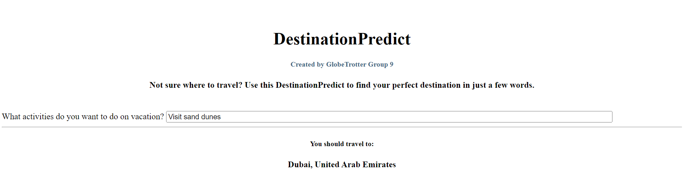

# DestinationPredict.
Transforming Travel Experiences

## Project Overview
In the ever-expanding landscape of travel, the aim of this project is to revolutionize the industry by addressing a critical need for personalized recommendations. Traditional travel advisory services fall short in providing tailored experiences, leading to a lack of engagement among modern adventurers. Our project aims to fill this gap by deploying a data-driven solution that enhances user engagement and rejuvenates the travel sector. In order to increase engagement in the travel industry and increase excitement about travel opportunities, this is where DestinationPredict come in handy!

The DestinationPredict is a data product that allows future travelers to get a prediction for their perfect destination with the input of just a few words. Trained on over 28,000 unique text data points, the Destination Dictionary is able to predict a destination from 12 different popular cities with 81% accuracy based on text input of activities you want to do while on vacation.

## Scraping of the Data(Data Mining)
This project utilized data from 12 top cities from TripAdvisor's list of Traveler's Choice destinations for Popular World Destinations , which can be found at (https://www.tripadvisor.com/TravelersChoice-Destinations). The dataset was compiled by scraping the titles from Tripadvisor 'attractions' for each of the 12 cities. The final dataset included over 28,000 unique text values.

# EDA

The Exploratory Data Analysis for this project was mainly devoted to exploring some cleaning and preprocessing techniques for the text data using Natural Language Processing. I also investigated different vectorization strategies for the data and looked into specific words/phrases that needed to be cleaned/removed from the dataset.

## Findings
In order to classify the text data into different classes, I experimented with 3 different vectorization strategies:

-Count Vectorization

-TF-IDF Vectorization

-Count Vectorization using Bi-Grams

After analyzing the document term matrices, word clouds, and top words generated by each of the three vectorization methods, I determined that employing TF-IDF vectorization is the optimal strategy. This approach is commonly utilized for categorizing news articles accurately into respective topics, mirroring the objective of the Destination Dictionary. The goal is to categorize text accurately into corresponding cities, and TF-IDF vectorization offers a suitable metric for gauging the significance of words concerning each specific city.

## Sample Word Clouds with TF-IDF Vectorization

## Recommendation for Modeling

Based on the results of the EDA, I would recommend removing the following words from the corpora/text data:

City names (i.e. 'Paris', 'Rome', 'Sicily', etc)
Most of the attractions are listed with the city name included (ex. Paris Champagne Tasting), however when the model gets new data, it will not have the city name. For this reason, it is best to train the model without the city names to get scores that are more indicative to its performance for its use-case.
The words 'private', 'airport', and 'transfer'
Most of the cities have 'Private airport transfer' as an attraction listed in their corpora. Since this does not tell us anything about the city, we should remove these data points/words before training the model.

# Model Analysis
My final model is a Multinomial Naive Bayes classifier, which can predict a destination with 81% accuracy and an 82% F1 score. The text data put into this model is not lemmatized, but is lowercased with stopwords removed and city names removed.

### Model Fit & Score
I used accuracy and F1 score to score this model. Since there are 12 classes, I want to model to be accurate, however, F1 score is also important to consider since there is some class imbalance in the dataset and to account for the model's false positives and false negatives.

The final model had the following training and testing accuracy and F1 scores:

Testing Accuracy Score 0.81 | F1 Score 0.82
Training Accuracy Score 0.86 | F1 Score 0.86
Looking at the above scores for both accuracy and F1, we can conclude that the model is a tiny bit overfit, but overall very accurate, especially considering that there are 12 classes.

### Confusion Matrix
The final model's confusion matrix from the test set is depicted below.

# The Final Product
The Destination Dictionary final product is a dash app hosted on my local machine (soon to be hosted on Render as well!). Check out a screenshot below, or see my non-technical walkthrough to see it in action!

See the interactive app [here](<https://destinationpredict-8pym.onrender.com/>) and find the full Dash app repository [here](<https://github.com/jonvis23/destinationpredictapp>).

# Recommendations for Use in the Travel Industry
Integrate the Destination Dictionary technology into pages where Top Destination lists are published to drive engagement with future travelers and drive traffic to affiliate links

Use the Destination Dictionary technology paired with a chatbot on travel websites to act as a virtual travel agent

Offer paid sponsorship of the 'default' city-- i.e. Tourism Board of Bali can pay be the first recommended city when you open the page

# Future Work
If I had time to explore further, I would investigate the following:

* Continue tweaking the cleaning/preprocessing steps to improve model recall score
* Train the model on more classes/cities to include the entire 25 destination list
* Train a Deep NLP model on the dataset using LSTMs and GRUs
* Improve Dash App

  
# Thank You!
I hope this project inspires your future travels! Please contact me with any questions:

# Destination-Predict
